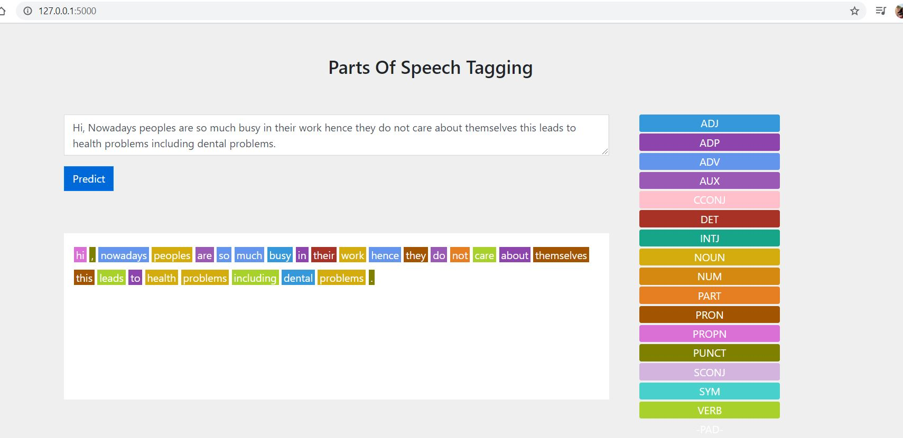

# NLP-Projects
## 1. POS Tagging using BERT
### Problem Statement:
In this project we will be performing one of the most famous task in the field of nautal language processing i,e Parts of Speech Tagging using BERT.
### Description Overview:
Part-Of-Speech tagging (POS tagging) is also called grammatical tagging or word-category disambiguation. It is the corpus linguistics of corpus Text data processing techniques for marking meaning and context.

Part-of-speech tagging can be done manually or by a specific algorithm. Using machine learning methods to implement part-of-speech tagging is the research content of Natural Language Processing (NLP). Common part-of-speech tagging algorithms include Hidden Markov Model (HMM), Conditional Random Fields (CRFs), and so on.

Part-of-speech tagging is mainly used in the field of text mining and NLP. It is a preprocessing step for various types of text-based machine learning tasks, such as semantic analysis and coreference resolution.
### Technology used: 
Anaconda Python 3.6 , Pytorch 1.6 with GPU support CUDA 10.1 with CuDNN 10.1. Install the necessary packages from requirements.txt file using the command pip install -r requirements.txt

## 2. Text Generation using GPT2
GPT-2 is a successor of GPT, the original NLP framework by OpenAI. The full GPT-2 model has 1.5 billion parameters, which is almost 10 times the parameters of GPT.
### Problem Statement:
In this project we will be generating Text using GPT2-large model.
### Description Overview:
Why we used GPT2LMHeadModel?

We used GPT2LMHeadModel class with the extra linear layer at the end (head). This extra layer will convert the hidden states (exactly 768 hidden states) into 50257 out_features. 

Why the 50257 is important?

This is the vocab size of the GPT-2 transformer. Based on that at the end we will get the probabilities for each word from the vocab.
If we would not have the last layer we would not have the mean to interpret the hidden states, or in other words our output would be the hidden states.
The LMHead part is there to extract the information from the hidden states and to convert them to output tokens.

### Technology used: 
Anaconda Python 3.6 , Pytorch 1.6 with GPU support CUDA 10.1 with CuDNN 10.1. First install the Transformers from Hugging Face.
!pip install -q git+https://github.com/huggingface/transformers.git

